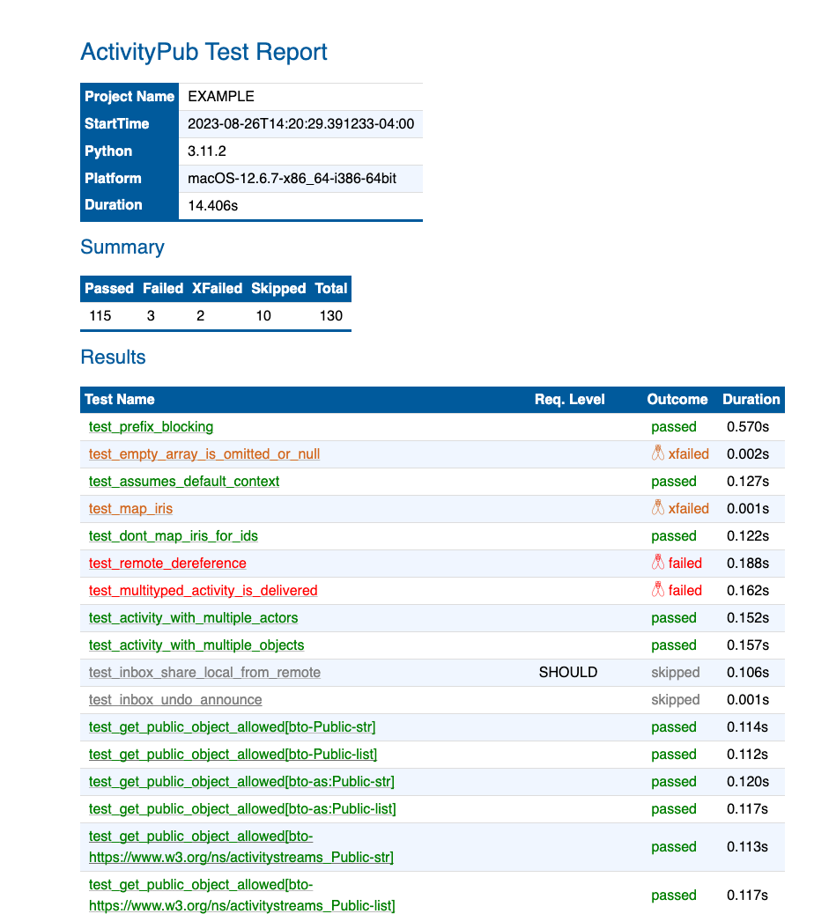
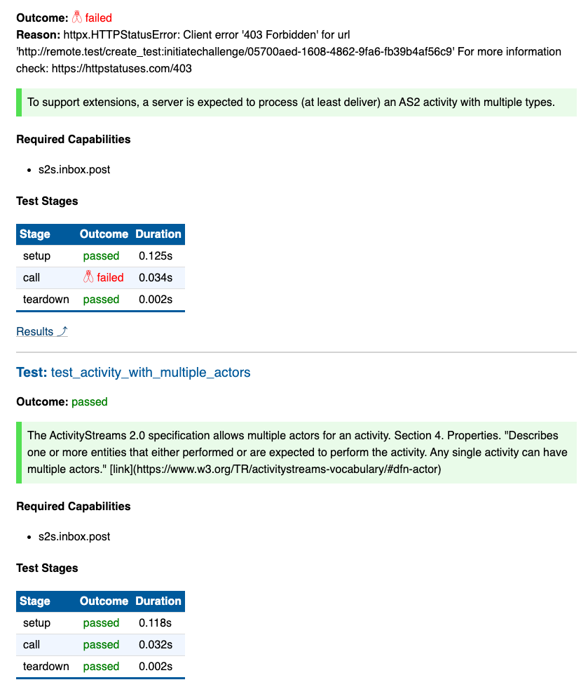

# ActivityPub Test Suite (activitypub-testsuite)

Server-independent, full-automated test suite primary focused on ActivityPub server compliance testing.

> [!NOTE]
> The original proof-of-concept projects have been retired. Although a few PRs were accepted for issues found with the test framework, the project developers were mostly disinterested. I'll be focusing on using the test framework to test my own server implementation called [FIRM](https://github.com/steve-bate/firm)

> [!WARNING]
> This is an exploratory proof-of-concept. It works, but if you're looking for a simple, easy-to-use, low effort tool, this isn't it. The current documentation is minimal and mostly intended to support collaboration with server developers rather than to support the creation of test support code for new servers. If there's enough interest, that will change over time.

Note that this project is not a standalone test suite project. It is designed to be used by server-specific test projects that implement test support code (and possibly additional tests) specific to that server.

As mentioned in the project summary, the test suite is currently focused on ActivityPub compliance testing. However, if well-defined requirements are defined for other needs like server interoperability testing, this framework is intended to support that goal in the future.
## Primary Goals

* Server-independent, reusable test framework
* Highly-configurable
* Fully automated
* Supports test isolation
* Supports local testing (no external servers required)
* Reasonably fast

The benefit of server-independence is that the tests can be re-used with multiple server implementations. Currently, the common approach when there are tests, is to write server-specific tests suites. This duplicates work since most of the ActivityPub tests will be similar for each server. This test suite aims to provide a common set of tests that can be used to test any ActivityPub server.

The test suite is implemented in Python ([`pytest`](https://docs.pytest.org/)), but supports testing servers written in any programming language.

The ActivityPub and ActivityStreams 2 specifications define many optional features and behaviors and there is room for reasonable people to disagree on the interpretation of these behaviors. This framework provides a way to configure the test suite for specific servers so that tests for unsupported features or that fail for known reasons can be skipped and documented. The plan is to create a test report generator that will use this information to describe server capabilities and test results.

There have been a few attempts to write server-independent tools, but they often require manual interaction with the testing tool. This is time consuming and tedious if a developer needs to run the tests many times. The natural tendency for developers is to take shortcuts in the testing process after they make changes, which can lead to errors in the released code (test regressions). A fully automated test suite is like having a QA team doing detailed testing whenever the code is modified.

For tests to be effective, the pre-test state should be known. Running multiple tests in a single server instance changes the state in ways that can affect subsequent tests (either falsely passing or failing). The tests in this suite are designed to run in a clean server state (test isolation).

To encourage running the tests often, the test suite should run as fast as possible while still testing the software effectively. Given these are integration tests, the tests will typically run slower than unit tests, but there are server-specific techniques that can be used to optimize the speed.

Other goals are to make it easy to add new tests and to make it as easy as possible to write a test driver layer for new server implementations.

After running the test suite, a test report can be generated to document the results. The report includes the test outcomes, test documentation, test parameters (if any), required capabilities for the test and more.

### [See also: Additional Documentation](docs/toc.md)

### Report Screenshots

## Contributing

This is more a research project than a stable product at the moment. However, collaboration is very welcome.

If you'd like to contribute, please contact me on the [Fediverse](https://social.technoetic.com/users/steve) or through my [GitHub account](https://github.com/steve-bate).

### License

[MIT License](LICENSE.txt)
