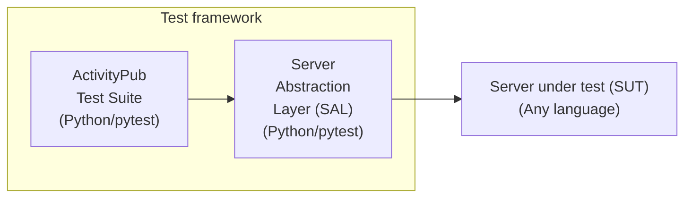
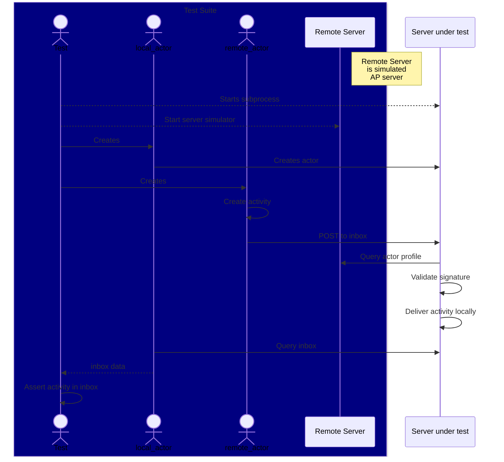

# Architecture

[Table of Contents](toc.md)

The overall architecture is shown in the following diagram.



The test framework consists of a set of server-independent tests and a server-specific layer that allows the tests to interact with the server under test (control it and observe side-effects).
## Test Suite

This is the core test suite. It's a library of reusable, server-independent tests that focus primarily on the [ActivityPub](https://www.w3.org/TR/activitypub/) and [ActivityStreams2](https://www.w3.org/TR/activitystreams-core/#object) specifications with a few extra tests outside that scope ([Webfinger](https://en.wikipedia.org/wiki/WebFinger), etc.). The tests are written in [Python](https://www.python.org/), but test servers can be written in any programming language. Although still evolving, the tests are intended to be be almost declarative. Eventually, they may be ported to the [Gherkin](https://cucumber.io/docs/gherkin/) syntax after the testing [DSL](https://en.wikipedia.org/wiki/Domain-specific_language) is stable.

In the future, this test suite may be extended with more tests that are outside the scope of ActivityPub *per se* but are more focused on interoperability in specific application domains (microblogging, image sharing, forums, etc.).

The server test suite is implemented using the [`pytest`](https://docs.pytest.org/) testing framework.

The tests are located in the `activitypub_testsuite/tests` subdirectory. The files are soft-linked into the server-specific test projects to run them.
## Server Abstraction Layer (SAL)

The *SAL* is a layer of code that normalizes test fixture access to the server under test (SUT). It's analogous to the concept of a [hardware abstraction layer](https://en.wikipedia.org/wiki/Hardware_abstraction) (HAL) in an operating system.

Depending on the server, the SAL may be very thin or require significant coding. For servers that support the standard ActivityPub C2S API, much of the SAL implementation can be reused from the test suite library. For servers with proprietary APIs, the SAL implementation will be more substantial.

## Server Under Test (SUT)

The server under test is any server that is being tested. It can be written in any programming language. The test suite will typically run non-Python servers in a subprocess and interact with it through network endpoints. Server implemented in Python may be run in-process with simulated network endpoints. The primary advantage of this is test execution speed.

To ensure test isolation, the server may be rebuilt and restarted for each test, or it may continue running for the duration of the test suite run and only have it's state (e.g., persistent storage) reset for each test. This will vary depending on the server implementation.

> [!NOTE]
> In some contexts, this documentation refers to the SUT as the "local server". This is in contrast to the a "remote server" which is a simulated server in the test framework.

## Example Test

This is a simple inbox POST test. To test the inbox POST, we need a local actor (in the SUT) and a simulated remote actor. This test specifies some metadata related to the ActivityPub requirements level (for test report generation) and the required ActivityPub capability (inbox post). It is parameterized to run for each allowed ActivityPub media type.

When the test is started, the initial server (SUT) state has no actors. The `local_actor` argument is a pytest fixture that will create the actor in the SUT. The `remote_actor` fixture will create a simulated remote actor and a simulated AP server that can provide for actor profiles, signatures, Webfinger, and other data requested by the SUT.

In this this, the remote actor creates an activity (`remote_actor.setup_activity`) and posts it to the `local_actor.inbox` endpoint using the specified media type. Note that a minimal amount of information is specified to the activity and the associated object. The necessary details are provided by the actor object either through defaults or actor-specific information.

The test uses the `local_actor` client (authenticated) to retrieve the inbox URIs and ensure the newly posted activity is in set of URIS.

The `test_inbox_post` function arguments are *test fixtures*. The `pytest` framework will create these automatically (dependency injection). In some cases, there are significant side effects to depending on a fixture. For example, the `remote_actor` dependency may cause a simulated remote server to be created and the `local_actor` might communicate with the server under test to get information (like profile data) it needs to interact with the local server.


```python
@pytest.mark.ap_reqlevel("MUST")
@pytest.mark.ap_capability("s2s.inbox.post")
@pytest.mark.parametrize("media_type", ALLOWED_AP_MEDIA_TYPES)
def test_inbox_post(remote_actor, local_actor, media_type: str):

    activity = remote_actor.setup_activity(
        {
            "to": local_actor.id,
            "object": remote_actor.make_object(),
        }
    )

    remote_actor.post(local_actor.inbox, activity, media_type=media_type)

    inbox = local_actor.get_collection_item_uris(local_actor.inbox)
    assert activity["id"] in inbox
```

Although it omits numerous details, the following sequence diagram gives an idea of the processing flow for a server being tested in an SUT running in a subprocess.


----
[Table of Contents](toc.md)
