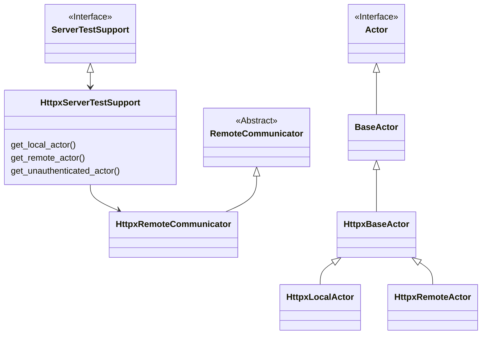

# Server Abstraction Layer (SAL)

[Table of Contents](toc.md)

The SAL provides an abstract interface for the tests to access a server under test (SUT). This allows the tests themselves to be server-independent.

> [!NOTE]
> Currently, the abstraction layer interfaces favors servers that implement the standard AP C2S API. More experimentation is needed for servers with proprietary APIs.

The types of operations the SAL must support include:

* Creating and configure actors in the SUT
* Posting to the inbox (ActivityPub S2S, if supported)
* Posting to the outbox (ActivityPub C2S, if supported)
* Accessing objects in the server
  * "Simple" object
  * Collections (including paged collections)
    * AP-defined collections (inbox, outbox, followers, etc.)
    * Custom collections (if supported)
* Simulating remote servers
  * Create and configure remote actors
  * Capture communication to remote actors
* Reset server state

These operations are implemented using several Python types defined using Python *protocols* (interfaces). The primary interfaces are:

| Interface | Description |
|-----------|-------------|
| `ServerTestSupport` | A factory for creating authenticated local and remote actors and unauthenticated actors. |
| `Actor` | Maintains actor authentication data and provides convenience methods for creates objects and activities and accessing server objects. |
| `RemoteCommunicator` | Captures communication from the SUT to the simulated remote server. |

The library has a `BaseActor` implementation of the `Actor` interface. This provides most of the core functionality needed to implement local and remote actors (clients). In many cases, the server-specific `Actor` implementations only need a few lines of code.

Supporting types include:

* `RemoteRequest`
* `RemoteResponse`
* `HttpResponse`
* `HttpRequestError`

These help to abstract the network and HTTP communication details. It's mostly useful for Python server testing where the server is embedded and may use different communication libraries than the test suite itself.

For servers that are started in a subprocess and using network communication, there are set of base classes that will provide most of the required functionality. These classes use the `httpx` Python network library.

The type relationships for the httpx-related classes are shown below.

# Test Utilities

The test suite libraries provides some utilities to help developers create Server Abstraction Layers. For example, there is code to do authentication with HTTP Signatures and bearer tokens.

---
[Table of Contents](toc.md)
